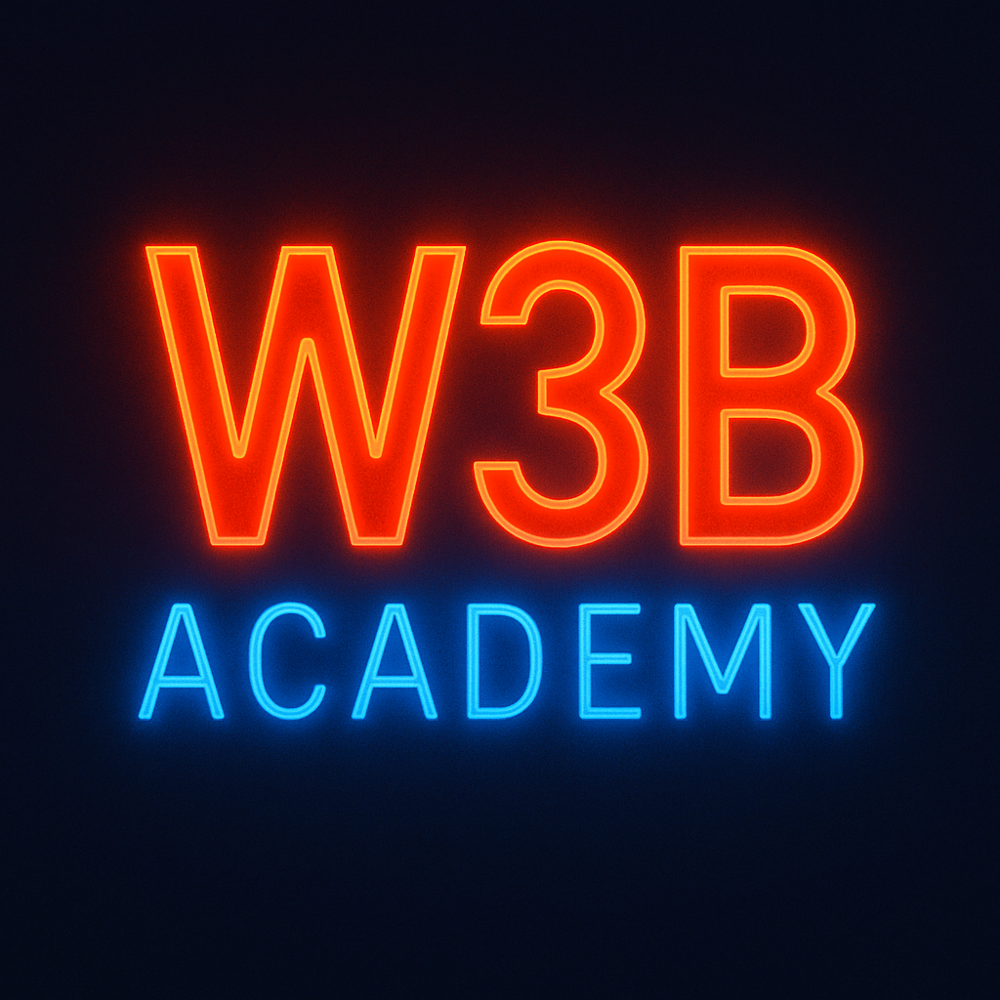

# 🌐 W3B Academy - Educational Website  

This project is a **multi-page educational website** developed during my junior stage in the **Frontend Development course**.  
It presents the mission of **W3B Academy (The Web 3 Academy LLC)**: an online platform dedicated to **Blockchain, Web 3.0, and Trading education**.  

---

## ✨ Features  

- 🎨 **Responsive design** built with **Bootstrap 5**  
- 🌓 **Dark/Light mode toggle**  
- 🎠 **Dynamic carousel** on the home page  
- 🔍 **Search & filter system** for program categories  
- ⭐ **Star rating module** to evaluate courses  
- 📩 **Contact form** with multiple fields  
- 📂 Clean and modular structure with separated CSS and JavaScript  

---

## 🗂️ Pages  

- **`Index.html`** → Home page with header, carousel, and academy introduction  
- **`Training.html`** → Overview of the **three main course branches**:  
  - Blockchain Course at W3B  
  - Trading Course at W3B  
  - Learn to Earn Course at W3B  
  Includes **star rating module** for program feedback  
- **`Blockchain.html`** → Blockchain programs with **search bar and category filter** (Beginner, Intermediate, Advanced)  
- **`Trading.html`** → Trading programs with search and category filter  
- **`LearnToEarn.html`** → Learn to Earn programs with search and category filter  
- **`Contact.html`** → Contact form (name, email, course selection, message)  

---

## 🛠️ Technologies Used  

- **HTML5**  
- **CSS3** (custom + Bootstrap 5)  
- **JavaScript (Vanilla JS)** for interactivity  
- **Font Awesome** for icons  

---

## 📚 Key Learnings  

✅ Building a **multi-page website** with a modular structure  
✅ Implementing **dark/light mode** across all pages  
✅ Creating a **search and category filter system** for courses  
✅ Designing a **course rating system with stars**  
✅ Developing a **contact form with multiple fields**  
✅ Using Bootstrap to speed up responsive layout design  

---

## 🚀 Preview  

  

---

## 📩 Author  

👤Franciny Fallas
🔗www.linkedin.com/in/franciny-fallas-709253268
